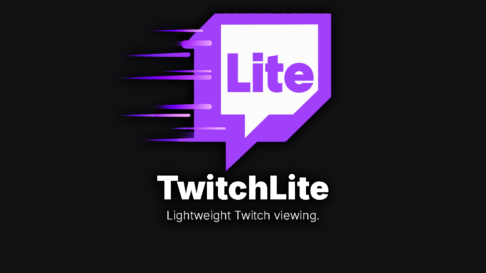
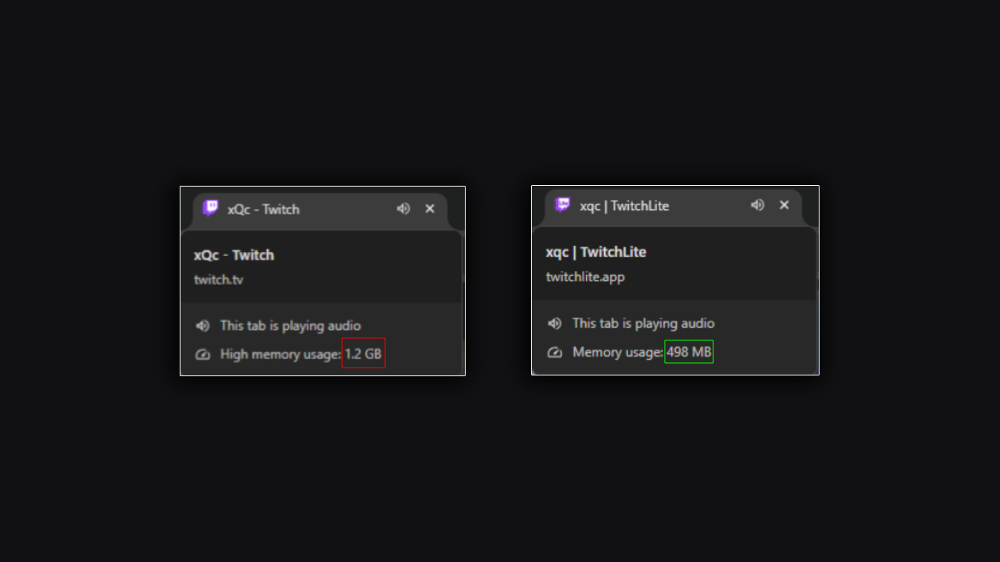

# TwitchLite



A lightweight customizable Twitch viewer designed to reduce unnecessary browser resource usage while providing a minimal, disctraction-free interface.

🌐 https://twitchlite.app

## Why TwitchLite?



The standard Twitch website can consume a significant amount of browser memory, especially during long viewing sessions. TwitchLite provides a more minimal viewing experience with multiple modes depending on how much functionality you want.

## Features

### Lite
- Stream + chat
- 7TV, BetterTTV, and FrankerFaceZ emotes
- Minimal interface
- Optimized for lower resource usage

### Balanced
- Everything in Lite
- Followed channels
- Channel search
- Additional Twitch functionality

### Custom
Choose exactly which features you want enabled and customize the viewing experience yourself.

## Memory Usage

In a benchmark done under controlled conditions:

| Mode | Average Memory Usage | Savings vs. Twitch |
| --- | ---: | ---: |
| Twitch | 1.37 GB | — |
| TwitchLite Lite | 710 MB | ~48% |
| TwitchLite Balanced | 824 MB | ~40% |

Memory usage varies depending on stream activity, chat activity, animated emotes, browser extensions, hardware, and other factors.

[View the full benchmark](https://twitchlite.app/benchmark)


## How It Works

The TwitchLite Chrome extension detects the Twitch channel you're viewing and lets you open it using one of TwitchLite's viewing modes. The viewer uses Twitch's embedded player alongside a custom interface and third-party emote support.

## Local Development

Clone the repository:

```bash
git clone https://github.com/hero0ic/TwitchLite
cd twitchlite
```

Install dependencies for the extension:

```bash
cd extension
npm install
npm run dev
```

Install dependencies for the viewer:

```bash
cd viewer
npm install
npm run dev
```

## Privacy

TwitchLite uses Twitch OAuth for optional account features such as followed channels. OAuth credentials are stored locally in the user's browser and are not stored on TwitchLite's servers.
[Privacy Policy](https://twitchlite.app/privacy)

## Disclaimer

TwitchLite is an independent project and is not affiliated with or endorsed by Twitch.
